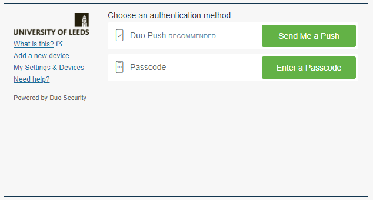
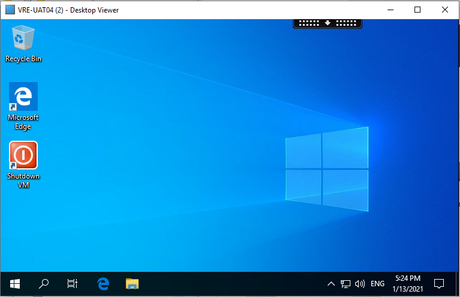

## How to connect to a Virtual Research Environment

    

        <iframe src="{{ video_src }}" width="100%" height="300" frameborder="0" marginwidth="0" marginheight="0" scrolling="auto" allowfullscreen="allowfullscreen" style="display:block;">
        </iframe>
        
 
            {{ video_description }}
        

    

### Prerequisites
You will need:
- Citrix Workspace installed to the machine you are connecting to LASER from.
  - Citrix Workspace is available through Software Centre on UoL managed devices.
- Duo two factor authentication enabled.
  - More infomation on DUO can be found [here](https://it.leeds.ac.uk/it/info/101/about_help_desk/142/privacy_notice?id=kb_article&sysparm_article=KB0014642).

### Log in to the Storefront
- Navigate to the StoreFront here: [https://laser.leeds.ac.uk/](https://laser.leeds.ac.uk/).
- Sign in using your University of Leeds credentials.
- When prompted, choose an authentication method and accept the login request/enter the passcode.  

- You may be asked if Citrix Receiver is installed:
  - Click to detect installation.
  - Allow browser to 'Open Citrix Workspace Launcher'.
  - If not detected but installation is present click 'Already installed'.
- You are now presented with all of the VRE desktops you have access to.
- Click on the image of the monitor or expand the options and click 'Open' to connect.  

  - You may be asked to download a *.ica launcher file.  
  
  - Save and open this file, it will be deleted when your session ends.
- Citrix Workspace will launch and connect to your chosen VRE desktop.  

